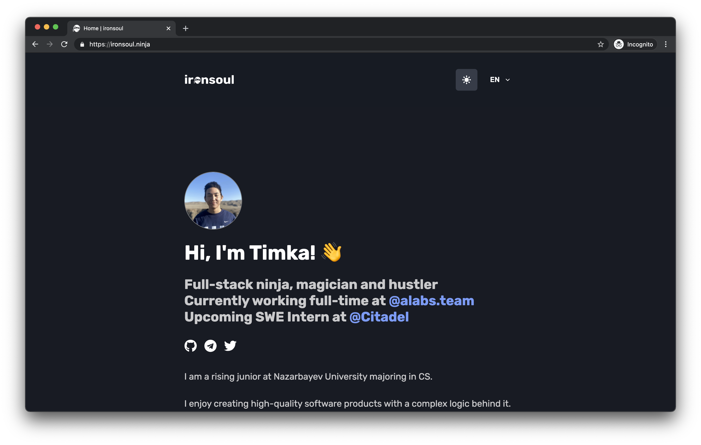

<div align="center">
  
</div>
<h1 align="center">
  ironsoul.ninja 🥷
</h1>
<p align="center">
   Built with <a href="https://www.nextjs.org/" target="_blank">Next.js</a> and hosted with <a href="https://www.vercel.com/" target="_blank">Vercel</a>
</p>



## 🛠 Wanna run on your machine?

1. Clone the project

   ```sh
   git clone https://github.com/ironsoul0/ironsoul.ninja.git
   ```

1. Install the dependencies

   ```sh
   cd ironsoul.ninja
   yarn
   ```

3. Start the development server

   ```sh
   yarn dev
   ```

## 🚁 Contributing

Feel free to contribute and suggest any improvements.

This repository is a full source of the website created using Next.js, TypeScript and React.

